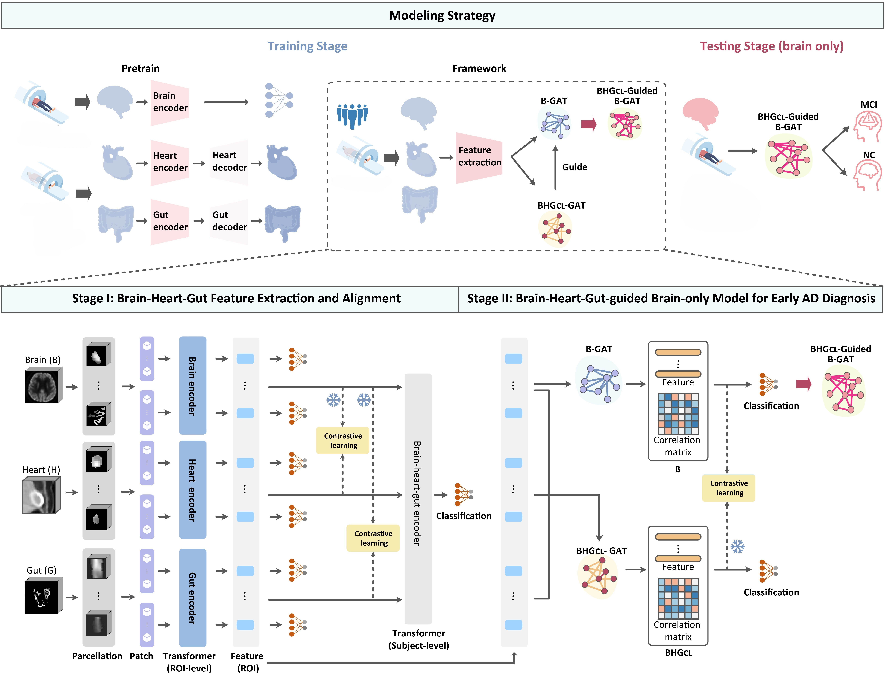
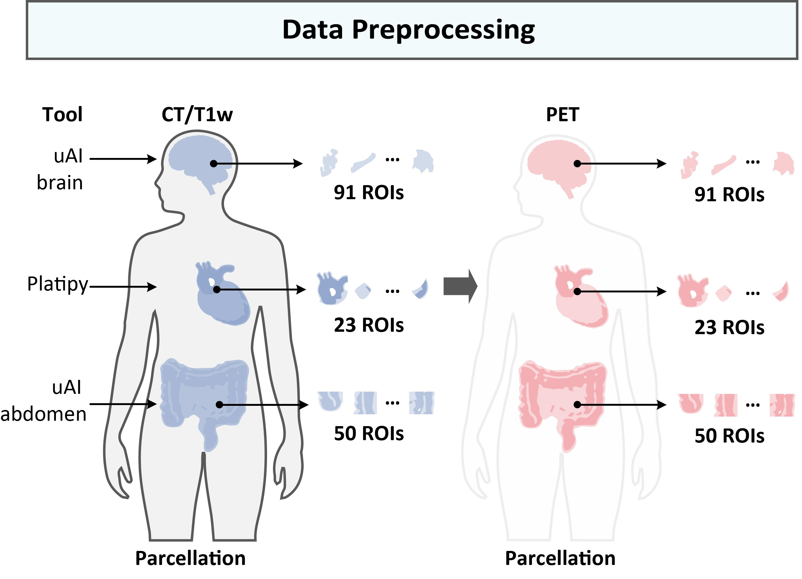

# Framework
Welcome! This is the official implementation of our paper "The Brain-Heart-Gut Axis in Whole-body PET: Guiding Early Alzheimer’s Diagnosis with Multi-organ Interactions"

## 1. Introduction
In this work, we exploit brain-heart-gut interactions using whole-body PET and we propose a brain-heart-gut guided framework for early AD diagnosis using only brain PET images.

Our proposed framework consists of two main stages:
**Stage I**: Brain-Heart-Gut feature extraction and alignment
**Stage II**: Brain-Heart-Gut-guided brain-only model for early AD diagnosis


Figure 1. An overview of the proposed framework

## 2. Data Preprocessing
We use paired whole-body PET/CT data and brain PET/MRI data. The standardized pipeline for preprocessing data is shown in Fig.2.
{:height="40%" width="40%"}
Figure 2. Data preprocess pipeline

### Preprocessing of brain images
1. Parcellat CT and T1w images using the **Desikan-Killiany (DK) atlas**, with tools provided by uAI (Shanghai United Imaging Intelligence Co., Ltd.).
2. Register PET images to MNI-152 template space with 1mm isotropic spacing utilizing rigid transformation.
3. Register CT and T1-weighted images to PET images.

### Preprocessing of heart images
1. Utilize [Platipy](https://pyplati.github.io/platipy/) to segment heart.
2. Align whole-body CT images with PET images using rigid registration.
3. Apply the transformation matrix to the segmented masks and resample heart images to the same isotropic spacing of 1mm as the brain images.

### Preprocessing of gut images
1. Using the abdomen segmentation tool from uAI to segment gut.
2. Apply rigid registration to spatially align the gut PET images with the
corresponding CT images.
3. Straighten the gut by [3D Slicer](https://www.slicer.org/).


ROIs of each organ are divided into patches with a size of `8 × 8 × 8` to deal with varying sizes of different ROIs. Codes of data preprocessing are in folder `./data_preprocessing`. You can run `./data_preprocessing/registraction.py` first to register PET and CT/MRI, then run `./data_preprocessing/crop_ROI.py` to get patches.

## 3. Model Pretraining
- For pretraining our brain model, we develop a **classification** network.
- For pretraining heart and gut models, we conduct **self-supervised reconstruction** network.

Codes of model pretraining are in folder `./model_pretraining`.
- Pretrain the brain model by simply running the following command: 
```
python brain_pretrain.py \
    --data_dir "your data dir" \
    --fold_path "your fold path" \
    --save_file_name "your save file name" \
    --batch_size "8" \
    --num_head "4" \
    --num_layers "4" \
    --dropout "0.5" \
    --dim_feedforward "216" \
    --hidden_dim_fc "128"
```

- Test the pretrained brain model by simply running the following command: 
```
python brain_pretrain_test.py \
    --data_dir "your data dir" \
    --fold_path "your fold path" \
    --batch_size "1" \
    --num_head "4" \
    --num_layers "4" \
    --dim_feedforward "216" \
    --hidden_dim_fc "128" \
    --pretrain_file "your pretrain file"
```

<!-- You can pretrain and test the model of heart/gut in the same way. -->
- Pretrain the heart/gut model by simply running the following command: 
```
python reconstruction_pretrain.py \
    --data_dir "your data dir" \
    --fold_path "your fold path" \
    --save_file_name "your save file name" \
    --batch_size "8" \
    --num_head "2" \
    --num_layers "2" \
    --dropout "0.5" \
    --dim_feedforward "216" \
    --hidden_dim_fc "128"
```

## 4. Stage I: Brain-Heart-Gut Feature Extraction and Alignment
The primary goal of the brain-heart-gut feature extraction stage (stage I) is to extract region-level disease-relevant features for brain, heart, and gut. 

- Train the feature extraction model by simply running the following command: 
```
for fold in {1..5..1}; do
    python bhg_feature_extraction.py \
        --root_feats_brain "your data dir" \
        --root_feats_heart "your data dir" \
        --root_feats_gut "your data dir" \                
        --fold_path "your fold path" \
        --save_file_name "your save file name" \
        --batch_size "8" \
        --dim_feedforward "216" \
        --hidden_dim_fc "128" \
        --fold "$fold" \
        --pretrain_brain "your brain weights" \
        --pretrain_heart "your heart weights" \
        --pretrain_gut "your gut weights"
done
```

- Test the feature extraction model by simply running the following command: 
```
for fold in {1..5..1}; do
    python bhg_feature_extraction_test.py \
        --root_feats_brain "your data dir" \
        --root_feats_heart "your data dir" \
        --root_feats_gut "your data dir" \                
        --fold_path "your fold path" \
        --save_file_name "your save file name" \
        --batch_size "8" \
        --dim_feedforward "216" \
        --hidden_dim_fc "128" \
        --fold "$fold" \
        --pretrain_weights "your weights"
done
```

## 5. Stage II: Brain-Heart-Gut-Guided Brain-only Model for Early AD Diagnosis
The goal of Stage II is to utilize the aligned features of brain, heart, and gut from stage I to enhance diagnosis performance of using solely brain PET image based on the guidance of brain-heart-gut interactions.

- Train the bhg GAT model by simply running the following command: 
```
for fold in {1..5..1}; do
    python bhg_GAT.py \
        --data_dir "your data dir" \
        --save_file_name "your save file name" \
        --batch_size "16" \
        --fold "$fold" \
        --hidden_layer_1 "115" \
        --hidden_layer_2 "105" \
        --region_size 164 \
        --feature_size "128" \
        --dropout "0.5"
done
```

- Train the brain-only GAT model by simply running the following command: 
```
for fold in {1..5..1}; do
    python b_align_bhg_GAT.py \
        --data_dir_brain "your brain data dir" \
        --data_dir_all "your all data dir" \
        --save_file_name "your save file name" \
        --batch_size "16" \
        --fold "$fold" \
        --hidden_layer_1 "115" \
        --hidden_layer_2 "105" \
        --region_size $allregion \
        --feature_size "128" \
        --dropout "0.5" \
        --pretrain_brain "your brain pretrain" \
        --pretrain_all "your all pretrain"
done
```

- Test the bhg GAT model by simply running the following command: 
```
for fold in {1..5..1}; do
    python bhg_GAT_test.py \
        --data_dir "your data dir" \
        --save_file_name "your save file name" \
        --batch_size "1" \
        --fold "$fold" \
        --hidden_layer_1 "115" \
        --hidden_layer_2 "105" \
        --region_size 164 \
        --feature_size "128" \
        --dropout "0.5"
done
